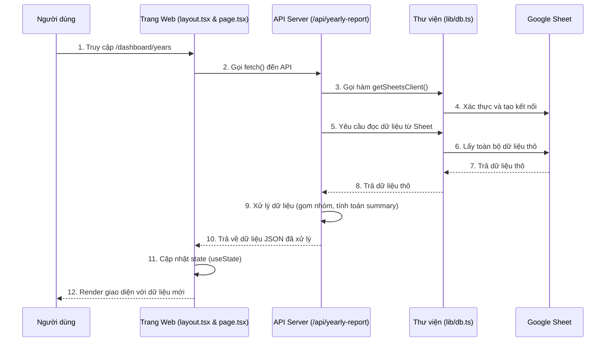

# Tài liệu Kỹ thuật: Project Manager Dashboard

Tài liệu này cung cấp một cái nhìn tổng quan về kiến trúc, luồng dữ liệu và các chức năng chính của ứng dụng Dashboard quản lý dự án.

---

## 1. Cấu trúc Thư mục

Dự án được xây dựng trên Next.js App Router với cấu trúc thư mục chính như sau:

```
/
├── app/
│   ├── dashboard/
│   │   ├── layout.tsx            # Layout chính chứa Sidebar và khu vực nội dung
│   │   └── years/
│   │       ├── page.tsx          # Trang chính hiển thị dự án, bộ lọc và các Modal
│   │       └── years.module.css  # CSS Module cho trang 'years'
│   │
│   ├── api/
│   │   ├── yearly-report/route.ts    # API chính để tải toàn bộ dữ liệu hiển thị
│   │   ├── manage-structure/route.ts # API trung tâm xử lý Thêm/Xóa Năm & Khách hàng
│   │   ├── add-project/route.ts      # API chuyên dụng để thêm dự án mới
│   │   ├── edit-project/route.ts     # API chuyên dụng để sửa thông tin dự án
│   │   └── delete-project/route.ts   # API chuyên dụng để xóa một dự án
│   │
│   └── globals.css               # Các style và biến CSS toàn cục
│
├── components/                     # Các component React tái sử dụng (VD: KpiCard)
│
├── lib/
│   └── db.ts                       # Trung tâm kết nối và tương tác với Google Sheets API
│
├── public/                         # Chứa các tài sản tĩnh (hình ảnh, fonts...)
│
└── tailwind.config.ts              # Cấu hình Tailwind CSS
```

---

## 2. Luồng Hoạt động Chính (Tải và Hiển thị Dữ liệu)

Luồng dữ liệu từ khi người dùng truy cập trang cho đến khi dữ liệu hiển thị được thực hiện như sau:



---

## 3. Kết nối với Google Sheets

Mọi tương tác với Google Sheets đều được quản lý tập trung tại file `lib/db.ts`.

#### 3.1. Xác thực
- **Cơ chế**: Sử dụng Service Account của Google Cloud.
- **Cấu hình**:
  1.  **Biến môi trường (Khuyên dùng)**: `GOOGLE_CREDENTIALS` (chuỗi JSON) hoặc `GOOGLE_CLIENT_EMAIL` + `GOOGLE_PRIVATE_KEY`.
  2.  **File vật lý**: `lib/credentials/service-account.json`.
- Hàm `getCredentials()` sẽ tự động tìm thông tin xác thực theo thứ tự ưu tiên trên.

#### 3.2. Các hàm chính
- `getSheetsClient()`: Hàm quan trọng nhất, tạo ra một đối tượng `sheets` đã được xác thực, sẵn sàng để tương tác với API.
- `getSheetData()`: Đọc dữ liệu từ một sheet cụ thể.
- `appendSheetData()`: Thêm một hoặc nhiều dòng mới vào cuối một sheet.
- `batchUpdate()`: (Sử dụng trong API `manage-structure`) Thực hiện nhiều thao tác (xóa, cập nhật) trong một lần gọi duy nhất, giúp tăng hiệu năng và đảm bảo tính toàn vẹn.

---

## 4. Phân tích Các Chức năng

#### 4.1. Hiển thị Dữ liệu
- **API Endpoint**: `GET /api/yearly-report`
- **Hoạt động**:
  - Nếu không có tham số `?project=`, API sẽ đọc toàn bộ sheet, xử lý và trả về:
    - `projects`: Danh sách dự án đã được gom nhóm cho cây thư mục.
    - `summary`: Các chỉ số tổng quan (tổng số dự án, khách hàng, năm...).
  - Nếu có tham số `?project=...`, API sẽ tìm và trả về chi tiết của duy nhất dự án đó.

#### 4.2. Thêm Dự án mới
- **Giao diện**: Modal "Thêm dự án mới" trong `page.tsx`.
- **API Endpoint**: `POST /api/add-project`
- **Hoạt động**:
  1. Người dùng điền thông tin và nhấn "Lưu".
  2. `page.tsx` gọi `fetch` đến API với dữ liệu dự án.
  3. API `add-project` sử dụng hàm `sheets.spreadsheets.values.append()` để thêm một dòng mới vào Google Sheet.
  4. Sau khi thành công, `page.tsx` gọi `router.refresh()` để yêu cầu Next.js tải lại dữ liệu mới nhất từ server, tự động cập nhật giao diện.

#### 4.3. Sửa/Xóa Dự án (Chi tiết)
- **Giao diện**: Các nút "Sửa", "Xóa" trên trang chi tiết dự án.
- **API Endpoints**: `PUT /api/edit-project` và `POST /api/delete-project`.
- **Hoạt động (Xóa)**:
  1. API `delete-project` nhận `projectId`.
  2. Nó đọc sheet để tìm ra **số thứ tự dòng** (row index) của dự án đó.
  3. Nó sử dụng `batchUpdate` với yêu cầu `deleteDimension` để xóa đúng dòng đã tìm thấy.

#### 4.4. Quản lý Cấu trúc (Năm & Khách hàng)
- **Giao diện**: Menu "Chỉnh sửa" và các Modal con trong `page.tsx`.
- **API Endpoint**: `POST /api/manage-structure`
- **Hoạt động**: Đây là API phức tạp nhất, nhận một `payload` mô tả hành động cần thực hiện.
  - **Thêm mới (`action: 'add'`)**:
    - API nhận `entity: 'year'` hoặc `'customer'` và `name`.
    - Nó sẽ `append` một dòng gần như trống vào sheet, chỉ chứa thông tin Năm hoặc Khách hàng mới để hệ thống ghi nhận sự tồn tại của chúng.
  - **Xóa (`action: 'delete'`)**:
    - API nhận `source` (tên cần xóa), `mode` ('cascade' hoặc 'move'), và `destination` (nếu là 'move').
    - Nó đọc toàn bộ sheet, tìm tất cả các dòng khớp với `source`.
    - Dựa trên `mode`, nó tạo một danh sách các yêu cầu (`requests`):
      - `cascade`: Tạo yêu cầu `deleteDimension` cho mỗi dòng.
      - `move`: Tạo yêu cầu `updateCells` để thay đổi giá trị của ô Năm hoặc Khách hàng.
    - Cuối cùng, nó gọi `batchUpdate` một lần duy nhất để thực thi tất cả các yêu cầu đã tạo.

```

Hy vọng tài liệu này sẽ giúp bạn và team dễ dàng hơn trong việc nắm bắt và phát triển dự án.

<!--
[PROMPT_SUGGESTION]Hãy giúp tôi tích hợp chức năng "Thêm dự án mới" vào API /api/manage-structure.[/PROMPT_SUGGESTION]
[PROMPT_SUGGESTION]Giải thích chi tiết về phương thức `batchUpdate` của Google Sheets API và tại sao nó hiệu quả hơn việc gọi nhiều API riêng lẻ.[/PROMPT_SUGGESTION]
->
Generated by Gemini 2.5 Pro
Prompts to try