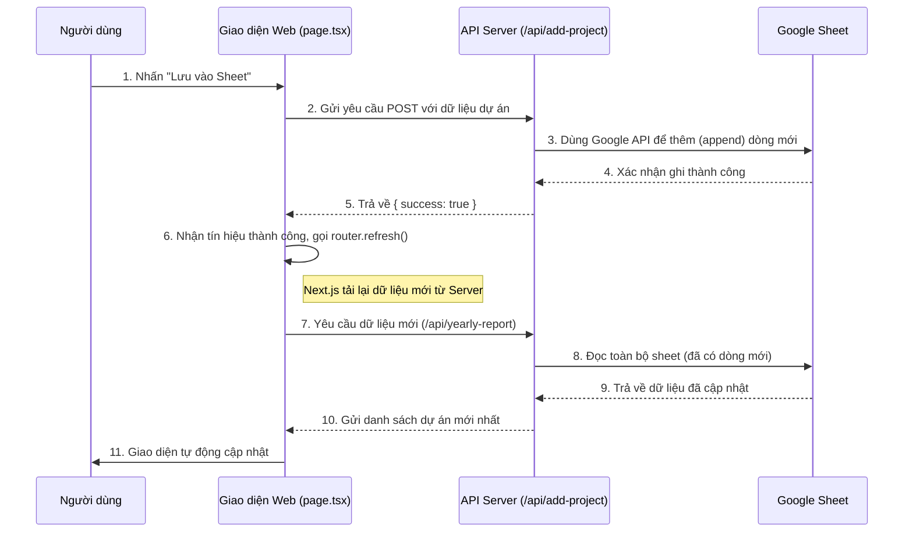

# Hướng dẫn Luồng Chức năng "Thêm Dự Án Mới"

Tài liệu này giải thích chi tiết cách chức năng "Thêm dự án mới" hoạt động, từ giao diện người dùng đến việc ghi dữ liệu vào Google Sheet và cách dữ liệu được đồng bộ ngược lại lên web.

---

## 🗺️ Sơ đồ Luồng Đồng bộ Dữ liệu



---

## ⚙️ Phân tích Chi tiết Từng Bước

### Bước 1 & 2: Gửi Dữ liệu từ Giao diện

- **File liên quan:** [`/Users/mac/dashboard_kpi/app/dashboard/years/page.tsx`](file:///Users/mac/dashboard_kpi/app/dashboard/years/page.tsx)

1.  Khi người dùng điền thông tin vào form "Thêm dự án mới" và nhấn "Lưu vào Sheet", hàm `handleAddNewProject` được kích hoạt.
2.  Hàm này tạo một yêu cầu `POST` đến API endpoint `/api/add-project`.
3.  Dữ liệu người dùng nhập (Năm, Khách hàng, Tên dự án) được đóng gói thành một đối tượng JSON và gửi đi trong phần `body` của yêu cầu.

```typescript
// Trích đoạn từ app/dashboard/years/page.tsx
const res = await fetch("/api/add-project", {
  method: "POST",
  headers: { "Content-Type": "application/json" },
  body: JSON.stringify(newProject),
});
```

### Bước 3 & 4: API Server Xử lý và Ghi vào Google Sheet

- **File liên quan:** `/Users/mac/dashboard_kpi/app/api/add-project/route.ts`

1.  API Server nhận yêu cầu, đọc dữ liệu JSON.
2.  Nó kết nối đến Google Sheets bằng `getSheetsClient()`.
3.  Sử dụng hàm `sheets.spreadsheets.values.append()`, nó **thêm một dòng mới** vào cuối trang tính `Plan Link2`. Dữ liệu được định dạng đúng theo các cột (B, C, D).
4.  Hành động này ghi dữ liệu **trực tiếp** vào file Google Sheet của bạn.

### Bước 5 đến 11: Đồng bộ ngược lại Web

- **File liên quan:** `/Users/mac/dashboard_kpi/app/dashboard/years/page.tsx`

Đây là bước quan trọng nhất để đảm bảo giao diện được cập nhật.

1.  Sau khi API ghi vào Sheet thành công, nó trả về một JSON `{ success: true }`.
2.  Giao diện web nhận được tín hiệu này.
3.  Thay vì chỉ tự thêm dự án vào một danh sách tạm, code sẽ gọi hàm `router.refresh()`.
4.  `router.refresh()` là một tính năng của Next.js, nó yêu cầu trình duyệt **tải lại dữ liệu mới từ server** cho trang hiện tại mà **không làm mới toàn bộ trang**.
5.  Việc này kích hoạt lại các lệnh `fetch` dữ liệu (ví dụ: gọi lại API `/api/yearly-report`).
6.  API `/api/yearly-report` giờ đây sẽ đọc lại toàn bộ Google Sheet, bao gồm cả dòng dữ liệu bạn vừa thêm.
7.  Kết quả là cả danh sách dự án ở trang chính và cây thư mục ở thanh menu bên trái đều được cập nhật với dữ liệu mới nhất một cách tự động và đồng bộ.
