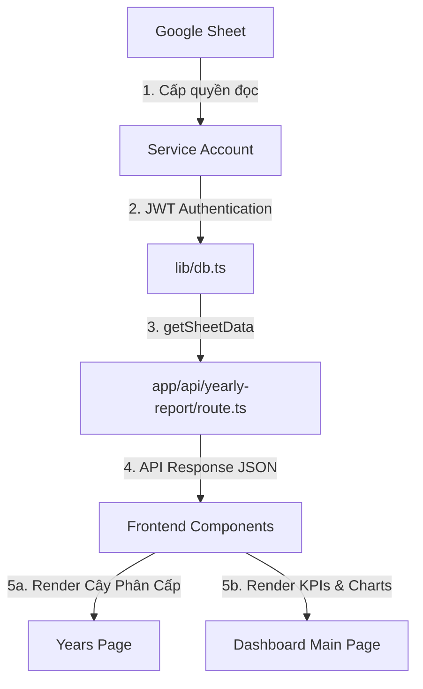

# Hướng dẫn Kết nối và Lấy Dữ liệu từ Google Sheets qua Code

Tài liệu này hướng dẫn chi tiết cách ứng dụng **Pulse Dashboard** kết nối, xác thực và lấy dữ liệu trực tiếp từ Google Sheets của bạn.

---

## 🗺️ Sơ đồ Luồng Dữ liệu (Data Flow)



---

## 🗝️ 1. Cấu hình Xác thực (Credentials)

Ứng dụng sử dụng **Google Service Account** để kết nối bảo mật mà không cần đăng nhập tài khoản cá nhân.

*   **File cấu hình:** [dashboard_kpi/.env.local](file:///Users/mac/dashboard_kpi/.env.local)
*   **Các biến môi trường chính:**
    *   `GOOGLE_CLIENT_EMAIL`: Email của Service Account (`poptech-pm@poptech-pm.iam.gserviceaccount.com`).
    *   `GOOGLE_PRIVATE_KEY`: Khóa bí mật (Private Key) dạng mã hóa để ký các yêu cầu API.

---

## 🛠️ 2. Các File Mã Nguồn Xử Lý Dữ Liệu

### Cấp độ 1: Khởi tạo kết nối & Truy vấn thô (Database Layer)
*   **File:** [lib/db.ts](file:///Users/mac/dashboard_kpi/lib/db.ts)
*   **Các hàm quan trọng:**
    *   `getSheetsClient()`: Lấy credentials từ biến môi trường, thiết lập JWT Auth với quyền truy cập Spreadsheet, và khởi tạo client API Google Sheets.
    *   `getSheetData(sheetName, spreadsheetId)`: Gọi hàm API của Google để lấy toàn bộ dữ liệu trong vùng từ cột A đến Z (`${sheetName}!A:Z`) của tab được chọn.

### Cấp độ 2: Xử lý & Chuẩn hóa Dữ liệu (API Layer)
*   **File:** [app/api/yearly-report/route.ts](file:///Users/mac/dashboard_kpi/app/api/yearly-report/route.ts)
*   **Luồng xử lý:**
    1.  Gọi `getSheetData("Plan Link2", SPREADSHEET_ID)` để lấy dữ liệu thô.
    2.  Vòng lặp chạy từ dòng thứ 2 (bỏ qua dòng tiêu đề):
        ```typescript
        const customerId = row[1]; // Cột B (CUSTOMID)
        const projectId = row[2];  // Cột C (PROJECTID)
        const year = row[3];       // Cột D (YEAR_BID)
        ```
    3.  Trích xuất 4 số đầu của năm (ví dụ: `2027_Bid1` -> `2027`) bằng Regular Expression:
        ```typescript
        const yearMatch = yearStr.match(/^(\d{4})/);
        const parsedYear = yearMatch ? yearMatch[1] : "Khác";
        ```
    4.  Tính toán các thông số thống kê tổng hợp động (`totalTasks`, `totalMandays`, `onTimeRate`) dựa trên tổng số lượng dòng và trả về kết quả dưới dạng JSON.

### Cấp độ 3: Nhóm và Hiển thị trên Giao diện (Presentation Layer)

#### Trang Báo cáo Năm (Yearly Reports)
*   **File:** [app/dashboard/years/page.tsx](file:///Users/mac/dashboard_kpi/app/dashboard/years/page.tsx)
*   **Cách nhóm dữ liệu:**
    Sau khi nhận danh sách dự án phẳng từ API, code thực hiện gom nhóm thành dạng lồng nhau: **Năm → Khách hàng → Dự án**:
    ```typescript
    const groupedData: Record<string, Record<string, string[]>> = {};

    filteredProjects.forEach((p) => {
      if (!groupedData[p.year]) groupedData[p.year] = {};
      if (!groupedData[p.year][p.customerId]) groupedData[p.year][p.customerId] = [];
      groupedData[p.year][p.customerId].push(p.projectId);
    });
    ```
    Sau đó, dùng thẻ HTML lặp qua cấu trúc này để tạo ra các khối accordion đẹp mắt theo cấu trúc yêu cầu.

#### Trang chủ Dashboard
*   **File:** [app/dashboard/page.tsx](file:///Users/mac/dashboard_kpi/app/dashboard/page.tsx)
*   **Luồng xử lý:**
    Gọi API `/api/yearly-report` và ánh xạ trực tiếp các dự án từ Sheet thành danh sách hiển thị tại phần **Active Projects** và đẩy dữ liệu lên biểu đồ cột hoạt động tuần.

---

## 📝 3. Cách thêm hoặc thay đổi cột lấy từ Sheet

Nếu bạn muốn lấy thêm dữ liệu từ một cột khác trong Google Sheet (ví dụ: lấy cột **E - HỢP ĐỒNG**):

1.  Mở file API [route.ts](file:///Users/mac/dashboard_kpi/app/api/yearly-report/route.ts).
2.  Bên trong vòng lặp `for`, lấy chỉ mục tương ứng (Cột E tương ứng với index 4):
    ```typescript
    const hopDong = row[4]; // Cột E (HỢP ĐỒNG)
    ```
3.  Thêm giá trị này vào object trả về của dự án:
    ```typescript
    projects.push({
      year: parsedYear,
      customerId: customerId.toString().trim(),
      projectId: projectId.toString().trim(),
      contract: hopDong ? hopDong.toString().trim() : "" // Thêm trường mới
    });
    ```
4.  Cập nhật TypeScript interface ở cả API và Frontend để hiển thị thông tin này lên giao diện.
